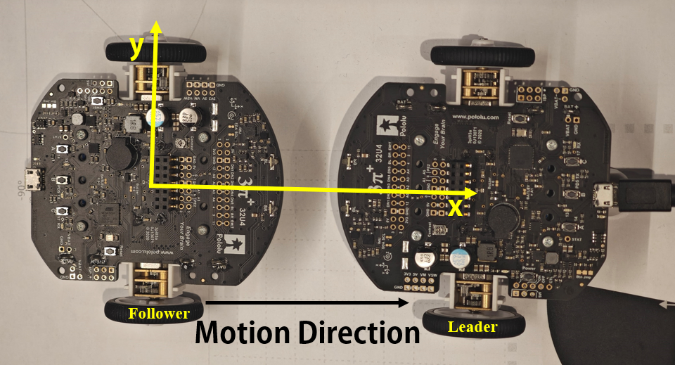
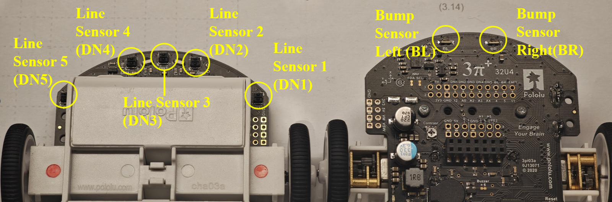
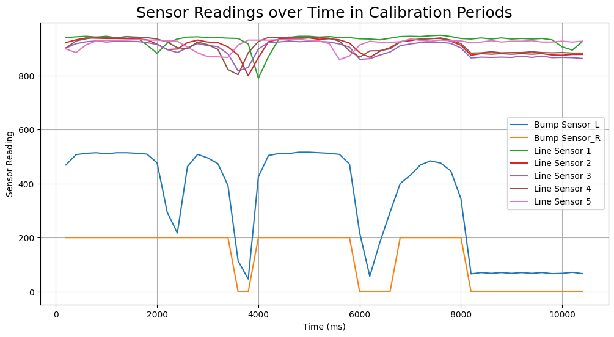
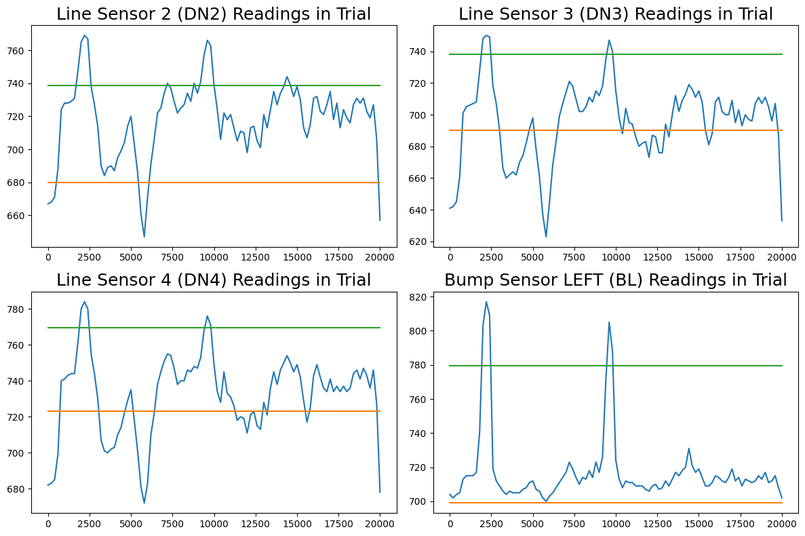
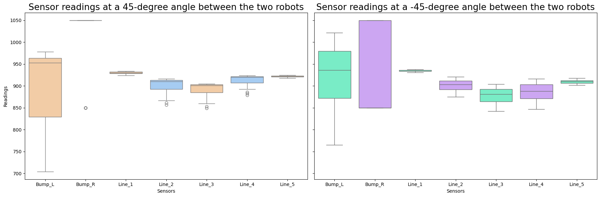

# Leader-Follower Systems with Sensor Integration on Pololu 3pi+ robots

## Overview
This project investigates the optimal combination of sensors for leader-follower systems using the Pololu 3pi+ robots. The goal is to improve signal detection accuracy, tracking stability, and response time under various motion scenarios, including constant speed, variable speed, and sudden turns.




## Key Features
- **Sensor Configurations**:
  - 2 Bump sensors only (BL, BR)
  - 5 Line sensors only (DN1, DN2, DN3, DN4, DN5)
  - Combination of bump sensors and line sensors
  - Selected sensors for sudden turns (left bump sensor and three middle line sensors)
- **Performance Metrics**:
  - Signal detection accuracy
  - Position deviation
  - Following stability (measured by RMSE)
  - Response time delay

## Methodology
The experiments included:
1. **Calibration**: Determining the optimal sensing range and following distance for line and bump sensors.
2. **Motion Scenarios**:
   - Constant speed linear motion
   - Variable speed linear motion
   - Sudden turn motion
3. **Data Analysis**: Collected sensor readings and trajectory data over 10 repeated trials per configuration.
4. **Evaluate**：Evaluate performance using RMSE, response time, and signal detection accuracy.

## Results
- The optimal performance was achieved with the combination of three middle line sensors and the left bump sensor.
- The fusion of these sensors resulted in a signal detection accuracy of 99% and a response time delay of approximately 400 milliseconds.







## Getting Started
### Prerequisites
- Two Pololu 3pi+ robots
- Arduino IDE for firmware development
- Serial Monitor for data collection

### Installation
1. Clone the repository:
   ```bash
   git clone https://github.com/your-repository-link
   ```
2. Open the Arduino sketch in the Arduino IDE.
3. Upload the code to the Pololu 3pi+ robots.

## Usage
1. Place the leader and follower robots on a flat surface.
2. Run the calibration sequence to set up the sensors.
3. Execute motion scenarios and collect data.

## Future Work
Further studies could explore:
- Advanced algorithms like adaptive PID.
- Machine learning techniques to enhance robustness and efficiency.


